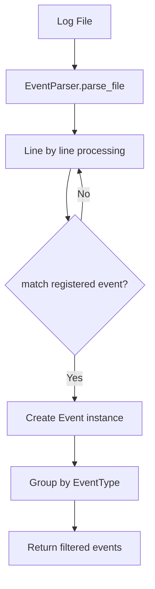
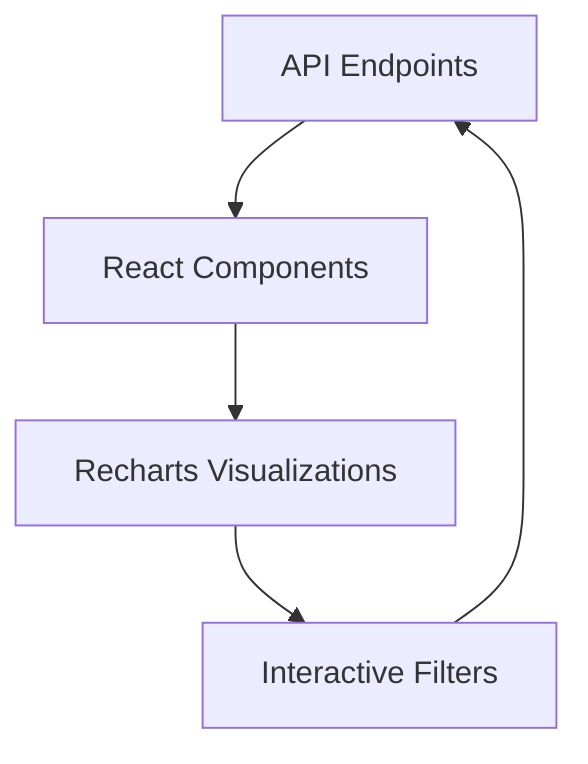

# CS:GO Match Visualizer Design

## Technologies

* **Python**
* **FastAPI**
* **Pydantic**
* **React**
* **TypeScript**
* **Recharts**
* **Docker**
* **Docker Compose**

### Scope

To make the project completeable within a reasonable timeframe, the following will be done to cut the scope:
1. No Database
2. Minimal Frontend Styling
3. Not 100% Test Coverage
4. As few supported events as possible
5. No caching (most requests could be)

## Backend Design

The backend will handle processing and parsing of CS:GO match logs, and will be written in FastAPI.
To get started quickly, `fastapi-forge` was used to create the initial project.

### Focused Stats

The following statistics are exposed by the API:
1. Average Round Time
2. Total Kills Per Player
3. Player Death Heatmap (Datetime Interval Query Param)
4. Money Spent Per Round (Round Interval Query Param)
5. Kills By Weapon (Round Interval, Weapon name Query Params)

### Event Processing Pipeline


The events package is located in `backend/src/events`, and contains all code related to events. 

Events are supported by creating a schema that represents it data.
After that, it must be registered in the ´EventRegistry`:

```python
@EventRegistry.register(EventType.PLAYER_ATTACK_PLAYER)
class PlayerAttackPlayerEvent(BaseEvent): ...
```
### Supported Events

The Supported events are as follows: 
1. `PLAYER_ATTACK_PLAYER`
2. `PLAYER_KILLED_PLAYER`
3. `PLAYER_PURCHASE`
4. `ROUND_START`
5. `ROUND_END`
6. `MATCH_STATUS_SCORE`

Supporting these events was necessary in order to fetch the stats I wanted.


### Design Principles

I will follow SOLID principles where it makes sense, especially for the event registration system. When adding support for a new event, it should be as easy as creating a new class that implements a base event interface. This class will then be registered with an event registry, which will later be used during the parsing process.


### Event Querying

To make querying events simple and repeatable, the `EventInteractor` class contains functionality for fetching, filtering, and applying intervals for events.

Below is an example of how a specific event can be queried:

```python
def get_events_per_rounds(
    self,
    event_type: EventType,
    interval: RoundInterval | None = None,
    filter_params: dict[str, Any] | None = None,
) -> dict[int, list[BaseEvent]]: ...
```

```python
interactor.get_events_per_rounds(
    event_type=EventType.PLAYER_KILLED_PLAYER,
    interval=RoundInterval(start=1, end=3),
    filter_params={"weapon": "ak47"}
)
``` 

All events of type `PLAYER_KILLED_PLAYER`, from round 1 to 3, with weapon `ak47` will be fetched.


## Frontend Design



### Core Components
- **Dashboard**: 2×2 grid of interactive charts
- **Visualizations**:
  - Kill Heatmap (positional data)
  - Weapon Performance (kills by round)
  - Player Stats (top fraggers) 
  - Economy Tracking (spending per round)
  - Match Summary (average round time)

### Key Features
1. **Filter System**:
   - Round range slider (1-22)
   - Weapon selector dropdown
   - Time interval picker
